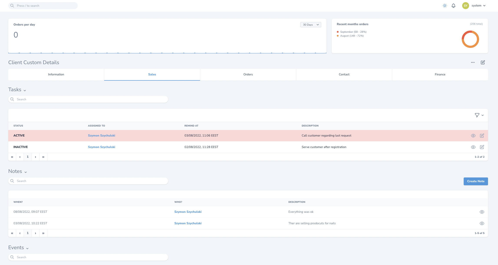
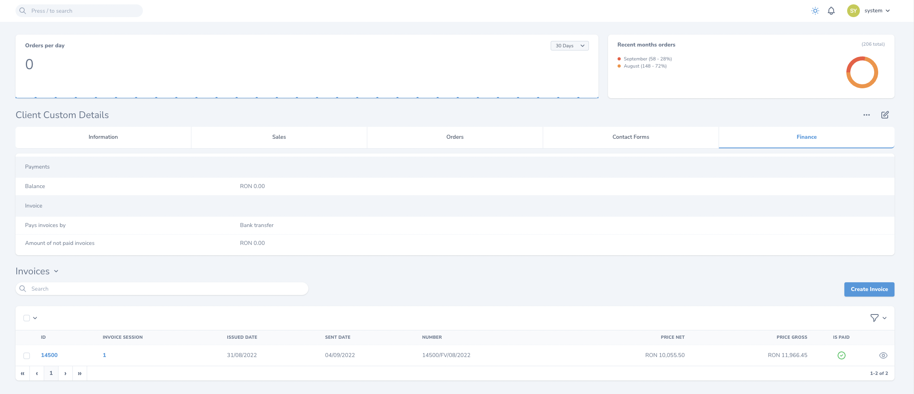

This package is based on [nova-tabs](https://github.com/eminiarts/nova-tabs) to make it more like resource navigation 
tabs instead of tabs just for relations.

In other words, the way of displaying panels and relations in tab content is the same like for normal resource. 
The only difference is that there are navigation menu. 

No changes needed regarding `nova-tabs` usage.

Keep in mind that you can use `->withToolbar()` on `Tabs` instance if you want to display toolbar 
(resource edit button and resource actions) in case that `Tabs` instance is the first field 
in your resource fields definition.

```
<?php

namespace App\Nova;

use Eminiarts\Tabs\Tab;
use Eminiarts\Tabs\Tabs;
use Eminiarts\Tabs\Traits\HasTabs;
...

class Customer extends Resource
{
    use HasTabs;
    
    public function fields(Request $request): array
    {
        return [
            Tabs::make('Client Custom Details', [
                Tab::make('Information', $this->informationTabFields()),
                Tab::make('Sales', $this->salesTabFields()),
                Tab::make('Orders', $this->ordersTabFields()),
                Tab::make('Contact', $this->contactTabFields()),
                Tab::make('Finance', $this->financeTabFields()),
            ])->withToolbar()
        ];
    }
     
    ...   
```

Screenshots:





